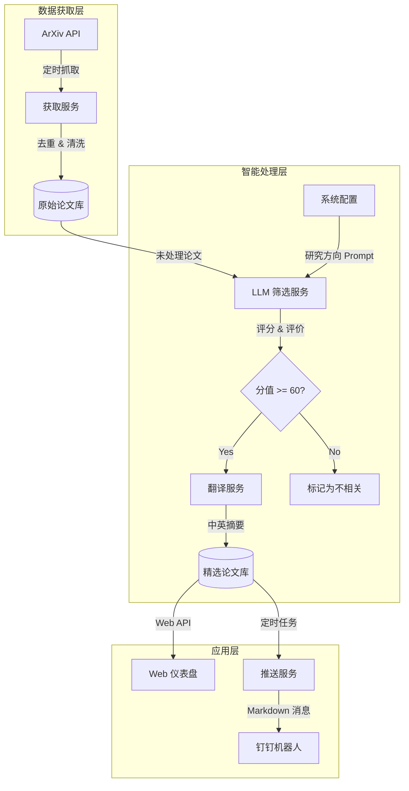

# 📚 Paper2Data: 您的 AI 科研情报助手 (v3.0)

[](https://www.python.org/downloads/)
[](https://fastapi.tiangolo.com)
[](https://vuejs.org/)
[](LICENSE)

> **告别信息过载。** 让 AI 帮您阅读每天的 ArXiv 论文，只把真正值得读的推送到您面前。

Paper2Data 是一个**开箱即用**的科研辅助系统。它集成了数据抓取、LLM 智能筛选、自动翻译和钉钉推送功能，并提供了一个现代化的 Web 界面来管理这一切。

---

## ✨ 核心亮点

- **🧠 懂你的 AI 助手**: 不只是关键词匹配，而是基于 LLM 深度理解论文内容，根据您的**自然语言研究描述**进行评分和筛选。
- **📊 可视化情报中心**: 内置精美的 Web 仪表盘，论文质量分布、每日获取统计一目了然。
- **⚡ 三合一极简架构**: 后端 (FastAPI)、前端 (Vue3) 和 调度器 (Schedule) 融合在单个进程中。没有复杂的 Nginx 配置，没有微服务，**运行一个 Python 脚本即可启动所有服务**。
- **📱 多端同步**: 支持钉钉机器人推送，早上通勤路上即可完成每日论文初筛。

---

## 📸 界面概览

> **👋 提示**: 为了获得最佳体验，请在项目运行后截图以下界面，并保存到 `docs/images/` 目录下（文件名参考下方说明），文档将自动展示您的截图。

### 1. 全局仪表盘 (`dashboard.png`)
实时监控系统状态，可视化展示今日论文获取数量、相关度评分分布以及系统健康状态。


### 2. 智能论文列表 (`paper_list.png`)
卡片式布局展示论文。每张卡片都包含 AI 生成的**中文标题**、**推荐理由**和**相关度打分**。支持按分数、日期、是否已读等多维度筛选。


### 3. 沉浸式详情页 (`detail.png`)
点击任意论文唤起侧滑抽屉。这里有中英对照摘要、潜在应用价值分析以及您的私人笔记区。


### 4. 可视化配置 (`config.png`)
无需修改代码或重启服务，直接在网页上调整研究方向描述、ArXiv 关键词和 LLM 模型参数。


---

## 🛠️ 系统架构



---

## 🚀 快速开始

### 1. 环境准备
确保您的系统已安装：
- Python 3.8+
- MySQL 8.0+

### 2. 安装与配置
```bash
# 克隆项目
git clone https://github.com/your-repo/paper2data.git
cd paper2data

# 安装依赖
pip install -r requirements.txt

# 配置文件
cp config.demo.py config.py
# ⚠️ 编辑 config.py，填入您的 MySQL 信息、LLM API Key 和 钉钉 Token
```

### 3. 启动系统
```bash
python app.py
```

启动成功后，访问：
- **Web 界面**: [http://localhost:20001](http://localhost:20001)
- **API 文档**: [http://localhost:20001/docs](http://localhost:20001/docs)

---

## 🔧 高级配置

### 如何让 AI 更懂我？
本系统的核心在于 `config.py` 中的 `RESEARCH_DESCRIPTION`。请尽可能详细地描述您的研究兴趣：

```python
RESEARCH_DESCRIPTION = """
我的研究方向是**多模态大模型在医疗影像中的应用**。
重点关注：
1. CLIP 模型在 X 光片上的微调策略
2. 医疗报告自动生成 (Report Generation)
3. 视觉问答 (VQA) 在病理切片上的应用

我不关注：
- 纯 NLP 文本摘要
- 传统 CNN 图像分割算法
"""
```
描述越具体，AI 筛选的准确率越高！

### 定时任务调整
在 `SCHEDULE_CONFIG` 中调整时间：
- `fetch_papers`: 建议设置为凌晨 (如 `02:00`)，此时 ArXiv 数据已更新。
- `push_papers`: 设置为您每天开始工作的时间 (如 `09:00`)。

---

## 📂 目录结构说明

```
paper2data/
├── app.py              # 🚀 启动入口 (FastAPI + Schedule)
├── services/           # 🧠 核心业务逻辑
│   ├── arxiv_service.py      # 数据抓取
│   ├── llm_filter_service.py # LLM 判别核心
│   └── ...
├── static/             # 🎨 前端源代码 (Vue3 单文件)
│   └── index.html      # 唯一的 HTML 文件，修改界面请动这里
├── tools/              # 🧰 运维工具箱
│   ├── rebuild_queue.py      # 重置推送队列
│   └── rescore_papers.py     # 重新给论文打分
├── logs/               # 📝 运行日志
└── docs/               # 📘 文档资源
    └── images/         # 存放截图
```

---

## 🤝 贡献与支持

如果您觉得这个项目对您有帮助，欢迎给一个 ⭐️ Star！
如有问题，请提交 Issue 或 PR。

**License**: MIT
