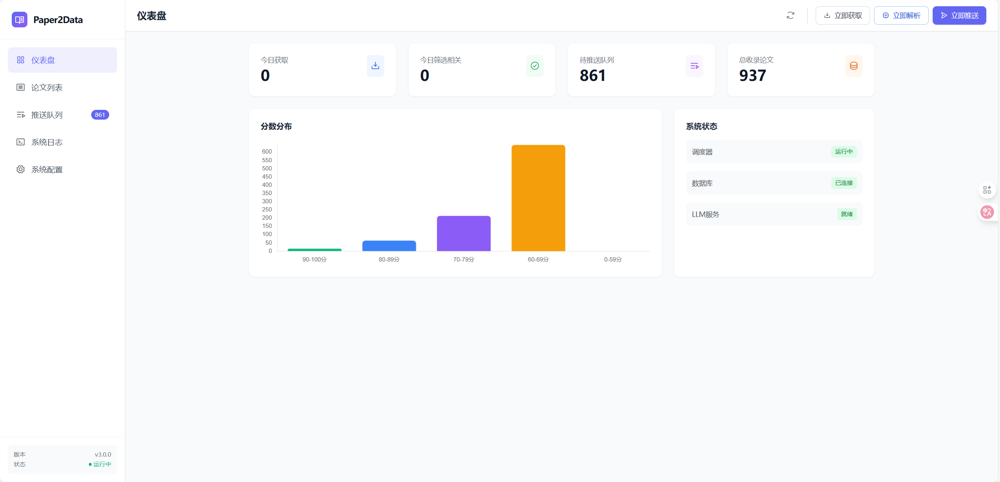
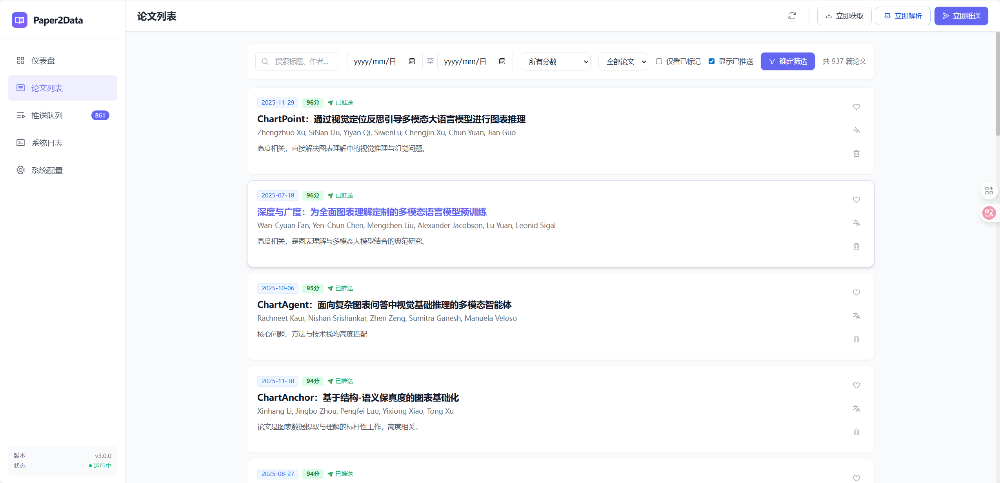
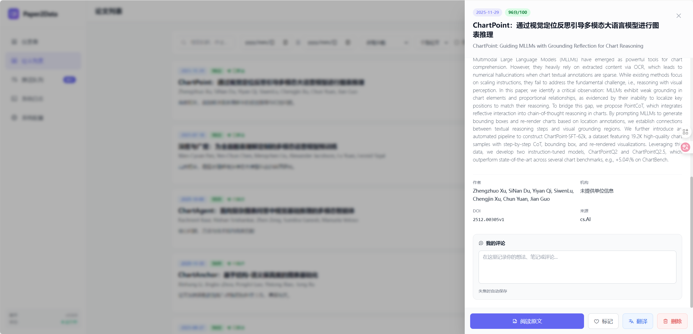
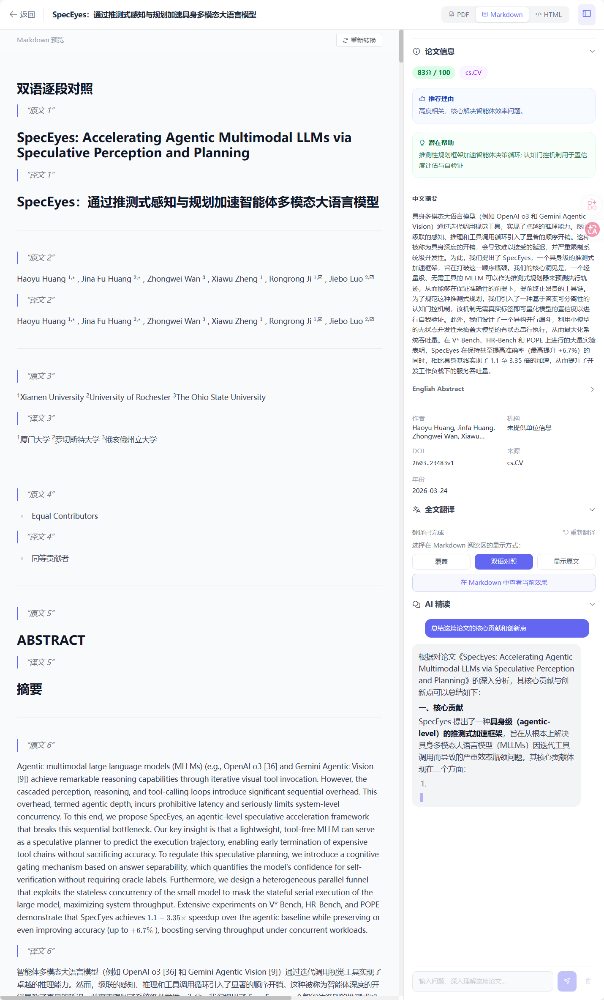
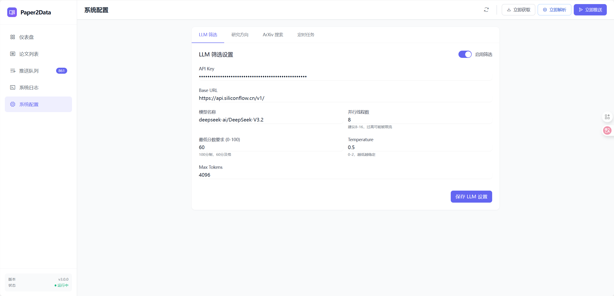
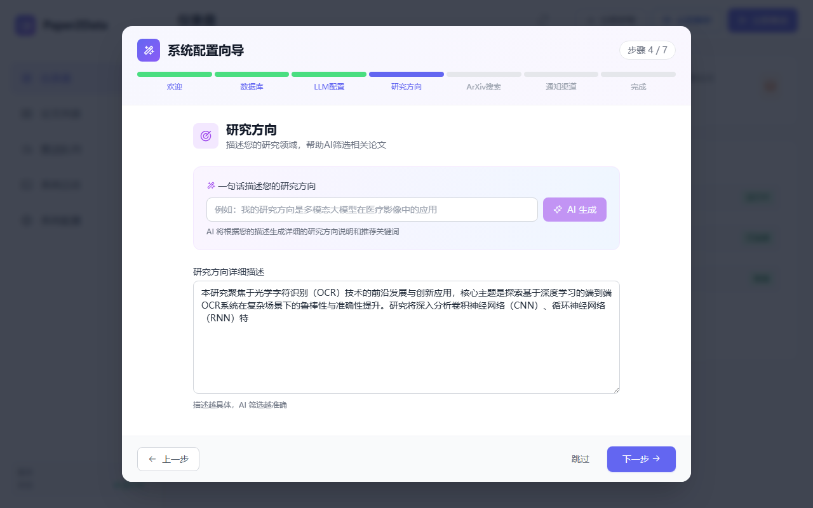
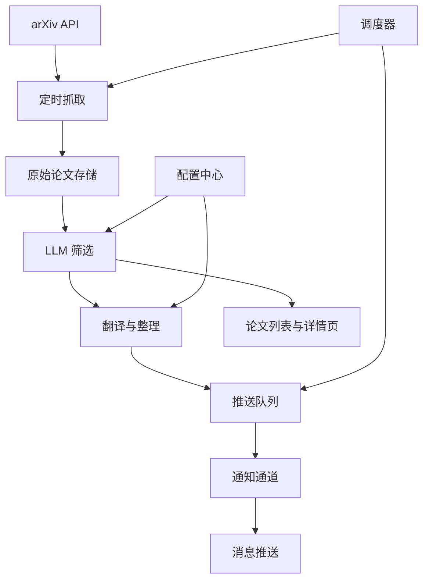

# DailyScholar

[](https://www.python.org/downloads/)
[](https://fastapi.tiangolo.com)
[](https://vuejs.org/)
[](LICENSE)

> DailyScholar 把每天的 arXiv 论文流，变成一套可配置、可追踪、可推送的科研工作台。
> 它先理解你的研究方向，再完成抓取、筛选、翻译、排队和通知，把“信息很多”变成“可直接处理的少量高价值论文”。
> 首次完成向导后，你还能直接查看并编辑研究配置、提示词和通知设置，系统不是黑盒。

## 核心价值

- 7 步初始化向导，首次启动即可完成数据库、LLM、研究方向、通知和配置确认。
- AI 自动生成研究配置，减少手填成本，帮助你更快得到可用的研究描述。
- 研究方向、arXiv 关键词、通知和提示词都能在界面里查看和编辑，配置透明可控。
- 提示词支持热更新，修改后立即生效，适合反复调优筛选口径和翻译风格。
- 8 种通知通道可选，既能满足个人接收，也能适配团队消息推送。
- 队列管理、定时调度和手动动作都已内置，方便补跑、重推和日常运维。
- SQLite 和 MySQL 都能用，数据库层会自动建表并完成基础迁移。
- 单进程启动，FastAPI 后端 + Vue3 前端 + 内置调度器，部署路径清晰。

## TODO 有好的功能都可以提issue~
- 论文精读智能体，生成一份完整的段落级别的快速全文阅读报告，创新点，对我的帮助，快速总结（50%）
- 接入更多的论文检索平台（0%）
- 全文翻译有bug，需要重写（30%）
- 论文阅读器增加更多功能（0%）

## 界面预览

### 仪表盘



### 论文列表



### 论文详情抽屉



### 论文阅读器



### 配置中心



### 初始化向导



## 主要功能

### 首次使用

- 自动识别是否需要初始化。
- 7 步向导覆盖数据库、LLM、研究方向、通知、配置确认和完成状态。
- 支持数据库连接测试、LLM 连接测试、通知测试和一键生成研究方向。
- 可直接读取已有配置，方便迁移或继续上次配置。

### 日常阅读

- 仪表盘看系统状态、论文数量和运行情况。
- 论文列表支持筛选、排序和搜索。
- 论文详情抽屉展示中英内容、推荐理由和补充信息。
- 论文阅读器支持 `PDF / Markdown / HTML` 三视图切换，并提供右侧信息栏与 AI 精读对话区。
- 全文翻译支持流式进度展示，完成后可在 Markdown 视图中选择覆盖、双语逐段对照、显示原文。
- 重新翻译会走强制重翻（不读取缓存），普通翻译会优先复用整篇与分块缓存。
- 翻译结果会保留在系统中，方便回看和二次筛选。
- 日志页可直接查看最新运行日志。

### 推送与调度

- 内置调度器，支持定时抓取、处理和推送。
- 手动动作包括立即抓取、立即处理、立即推送。
- 论文会进入推送队列，便于控制发送节奏。
- 可查看队列状态和队列预览。
- 通知通道支持 8 种选择，控制台、Bark、钉钉应用机器人、钉钉 Webhook 机器人、飞书、Telegram、SMTP 邮件、WxPusher。

### 配置与提示词

- `config` 页面能直接查看和修改运行配置，减少来回切文件。
- 研究方向、arXiv 关键词、调度时间、通知配置都能在线调整，生成后的研究配置也能继续查看和修订。
- 提示词支持读取、更新、重置，scoring anchors、few-shot examples、评估模板和翻译模板都可见可改。
- 调度配置变更后可重新加载，不需要手动重启。

## 核心流程



## 快速开始

### 1. 准备环境

- Python 3.8+
- 首次启动默认使用本地 SQLite，并进入 Web 初始化向导

### 2. 安装依赖

```bash
pip install -r requirements.txt
```

### 3. 启动服务

```bash
python app.py
```

### 4. 浏览器完成初始化向导

启动后访问：

- Web 界面, http://localhost:20001
- API 文档, http://localhost:20001/docs
- Health, http://localhost:20001/api/health

在 Web 界面按 7 步向导完成数据库、LLM、研究方向与通知配置，提交后即可开始日常使用。后续推荐在配置页面或 `/api/config/*` 接口更新配置。

## 初始化向导参考

DailyScholar 首次启动时，会按这组接口完成初始化流程：

1. `GET /api/setup/status`
2. `GET /api/setup/existing-config`
3. `POST /api/setup/test-db`
4. `POST /api/setup/test-llm`
5. `POST /api/setup/generate-research`
6. `POST /api/setup/test-notify`
7. `POST /api/setup/complete`

如果需要重新开始，还可以用：

- `DELETE /api/setup/reset`

## 配置与运维接口

### 配置

- `GET /api/config/all`
- `PUT /api/config/{name}`
- `GET /api/prompts`
- `PUT /api/prompts/{prompt_key}`
- `POST /api/prompts/{prompt_key}/reset`

### 调度与队列

- `GET /api/scheduler/status`
- `POST /api/scheduler/reload`
- `GET /api/queue/status`

### 手动操作

- `POST /api/actions/fetch-now`
- `POST /api/actions/process-now`
- `POST /api/actions/push-now`

### 阅读器与全文翻译

- `GET /api/papers/{doi}/pdf`
- `POST /api/papers/{doi}/convert`
- `GET /api/papers/{doi}/convert/status`
- `GET /api/papers/{doi}/markdown`
- `GET /api/papers/{doi}/markdown/images/{image_name}`
- `POST /api/papers/{doi}/translate-full`
- `GET /api/papers/{doi}/translate-full/status`
- `GET /api/papers/{doi}/translate-full/stream`
- `DELETE /api/papers/{doi}/translate-full/cache`
- `POST /api/papers/{doi}/chat`
- `GET /api/papers/{doi}/chat/history`
- `DELETE /api/papers/{doi}/chat`

### 日志

- `GET /api/logs/list`
- `GET /api/logs/content`

## 目录结构

```text
dailyscholar/
├── app.py
├── config.py
├── services/
├── static/
├── logs/
├── docs/
│   └── images/
└── tools/
```

## Star History

<a href="https://www.star-history.com/?repos=ShilongHong%2FDailyScholar&type=date&legend=top-left">
 <picture>
   <source media="(prefers-color-scheme: dark)" srcset="https://api.star-history.com/image?repos=ShilongHong/DailyScholar&type=date&theme=dark&legend=top-left" />
   <source media="(prefers-color-scheme: light)" srcset="https://api.star-history.com/image?repos=ShilongHong/DailyScholar&type=date&legend=top-left" />
   
 </picture>
</a>

## License

MIT
